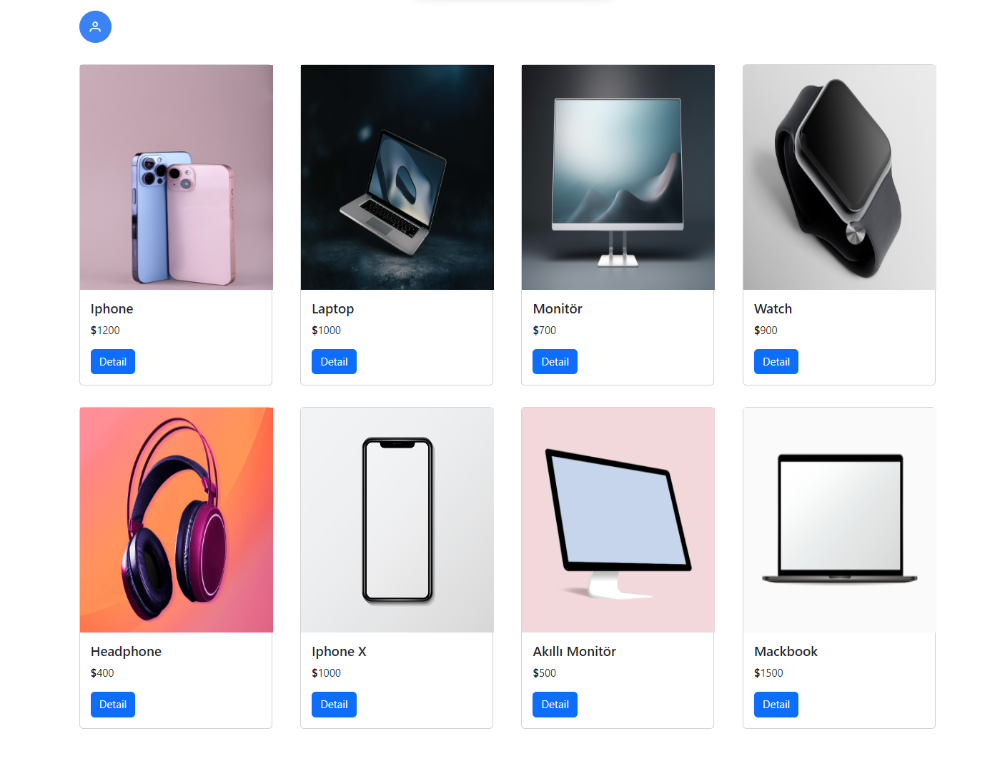
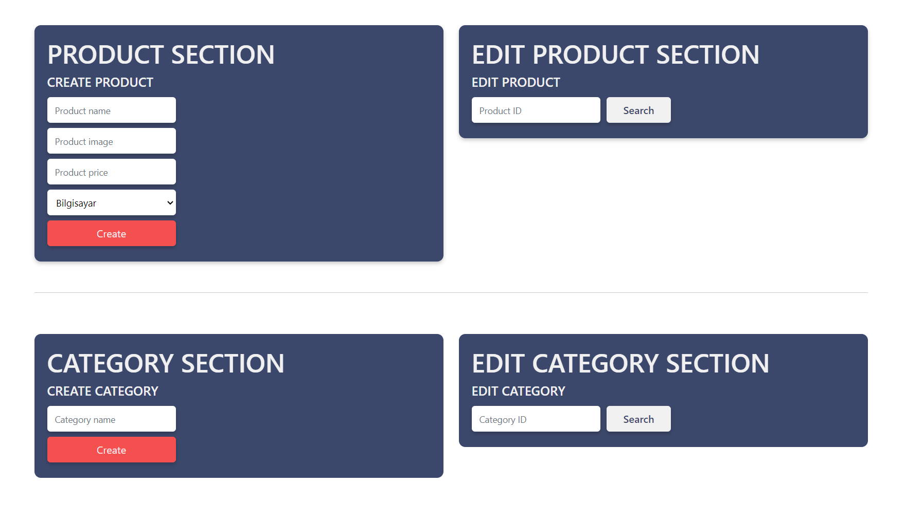
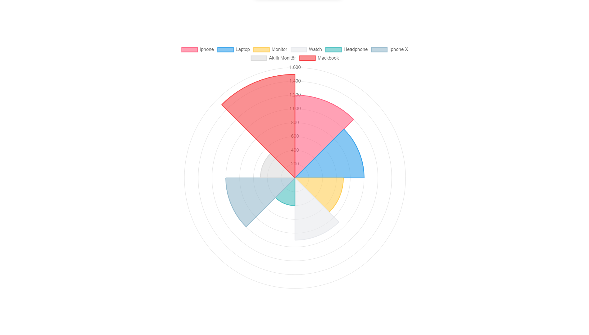

Bu proje, Laravel ve Angular ile geliştirilen bir web uygulamasını içerir. Bootstrap ve PrimeNG gibi popüler kütüphaneler kullanılarak oluşturulmuş ve PostgreSQL veritabanını temel almaktadır. Proje, temel CRUD işlemlerini içerirken aynı zamanda ChartJS kullanarak ürünlerin isimleri ve fiyatlarını grafiklerle görselleştirir.

KULLANILAN TEKNOLOJİLER
Laravel (Backend)
Angular (Frontend)
Bootstrap ve PrimeNG (Arayüz)
PostgreSQL (Veritabanı)

ÖZELLİKLER
Veritabanında temel CRUD işlemleri (Oluşturma, Okuma, Güncelleme, Silme)
Ürün isimleri ve fiyatlarına göre grafik tablolama
Backend ve Frontend arasında API servisi ile iletişim

